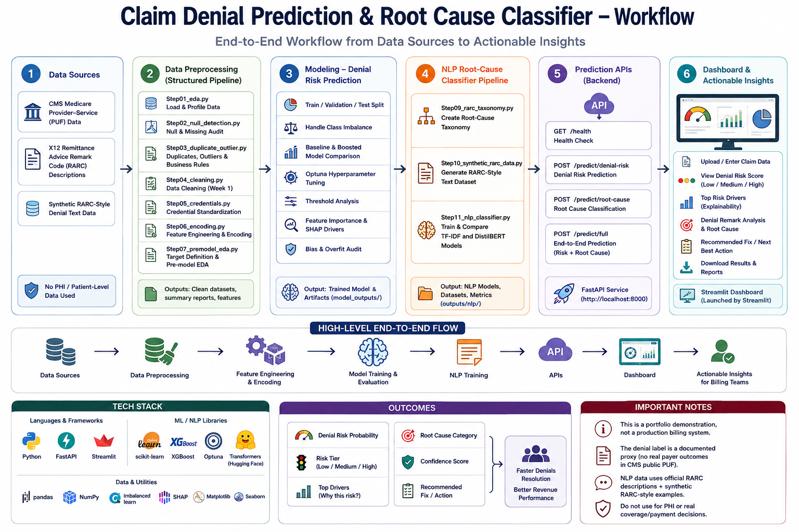
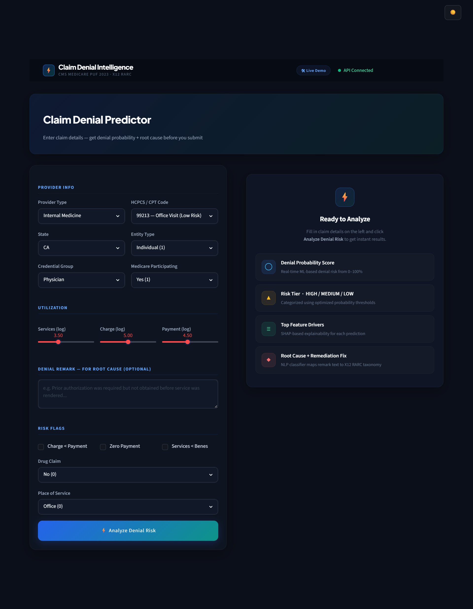
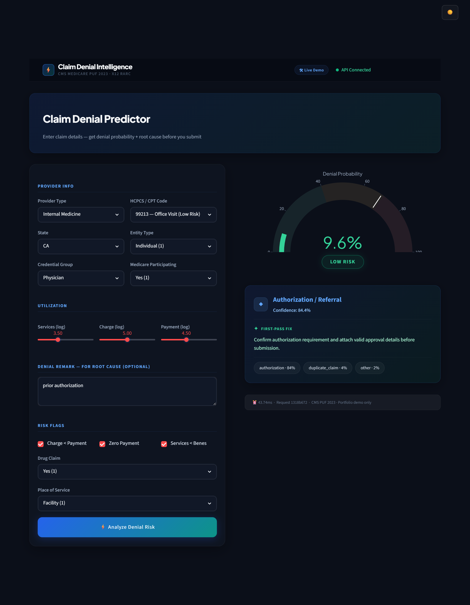

<div align="center">

# Claim Denial Prediction and Root Cause Classifier

An end-to-end healthcare Revenue Cycle Management system that predicts claim denial risk and classifies denial remark text into operational root-cause categories.

### Workflow Diagram



</div>

---

## Overview

Healthcare billing teams lose time and revenue when claims are denied after submission. This project brings that check earlier — before a claim is submitted, it estimates the probability of denial and, if a denial remark is provided, classifies the likely operational root cause with a recommended first-pass fix.

It combines structured CMS Medicare provider-service data with an X12 RARC-style NLP dataset, so billing teams can flag high-risk claims and route denial reasons to the right team before they become a loss.

---

## Key Features

- **Denial risk prediction** — a boosted tree model trained on CMS Medicare provider-service data, tuned with Optuna, returning a 0–100% denial probability
- **Risk tiering** — predictions are grouped into low, medium, and high risk using optimized probability thresholds
- **Root-cause classification** — an NLP classifier (TF-IDF and DistilBERT compared) maps denial remark text to an X12 RARC-style taxonomy
- **Explainability** — SHAP-based top feature drivers for every denial risk prediction
- **First-pass remediation** — each root-cause classification comes with a recommended fix and confidence score
- **FastAPI + Streamlit** — a live API backend and an interactive dashboard for entering claim details and reviewing results

---

## Application Screenshots

<div align="center">

### Claim Denial Predictor — Input
*Provider info, utilization sliders, denial remark text, and risk flags feed the model.*



<br /><br />

### Claim Denial Predictor — Result
*Denial probability gauge, risk tier, and root-cause classification with a recommended fix.*



</div>

---

## Project Structure

```
.
├── app/                 FastAPI service and Streamlit dashboard
├── src/                 Step-by-step data, ML, and NLP pipeline scripts
├── reports/             EDA, cleaning, feature, and modeling summary CSVs
├── outputs/              Lightweight NLP datasets, metrics, and charts
├── docs/                 Model cards, target definition, and full report
├── scripts/              Small helper scripts and API smoke tests
├── run_pipeline.ps1      Runs the full project pipeline
├── run_app.ps1           Starts the API and dashboard
├── setup_project.ps1     Creates environment and installs requirements
├── requirements.txt
└── README.md
```

Large raw data files, trained model binaries, virtual environments, and generated heavy artifacts are intentionally excluded so the repository stays clean.

---

## Data Sources

- CMS Medicare Physician & Other Practitioners by Provider and Service public use data
- X12 Remittance Advice Remark Code descriptions
- Synthetic RARC-style denial text generated from the documented taxonomy

No PHI or patient-level records are used.

---

## Pipeline

**Data preprocessing** (`src/step01` – `step07`): loads and profiles the raw CMS data, audits nulls and duplicates, cleans and encodes it, and defines the denial proxy target.

**Denial risk modeling** (`src/step08_model.py`): train/validation/test split, class imbalance handling, baseline vs. boosted tree comparison, Optuna tuning, threshold review, SHAP-style feature importance, and a bias/overfit audit.

**Root-cause NLP pipeline** (`src/step09` – `step11`): builds the RARC-style taxonomy and synthetic training text, then trains and compares TF-IDF and DistilBERT classifiers.

---

## Run Locally

```powershell
# Set up the environment
.\setup_project.ps1

# Run the full pipeline
.\run_pipeline.ps1

# Start the demo app
.\run_app.ps1
```

The app starts:
- FastAPI: `http://localhost:8000`
- Swagger docs: `http://localhost:8000/docs`
- Streamlit dashboard: launched by Streamlit

**API smoke test** (after starting the API):

```powershell
python scripts\sample_api_request.py
```

**Main endpoints:**

| Method | Endpoint | Description |
|---|---|---|
| GET | `/health` | Health check |
| POST | `/predict/denial-risk` | Denial risk prediction |
| POST | `/predict/root-cause` | Root-cause classification |
| POST | `/predict/full` | End-to-end prediction (risk + root cause) |

---

## Important Notes

- This is a portfolio demonstration, not a production billing system.
- The denial label is a documented proxy, since CMS public PUF data does not include real payer denial outcomes.
- The NLP training data combines official RARC descriptions with synthetic RARC-style examples.
- This project should not be used to process PHI or make real coverage/payment decisions.